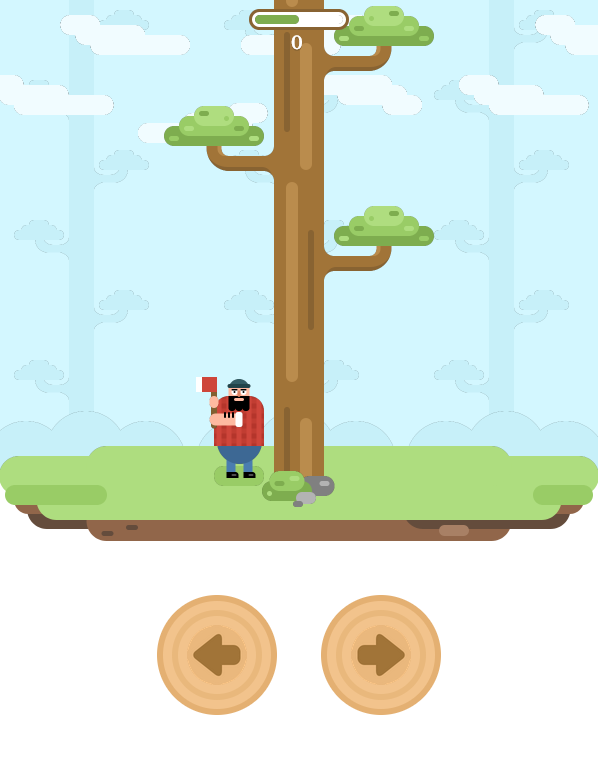

# lumbot

A bot to play LumberJack game.  
https://tbot.xyz/lumber/

`qlumbot.py` is a minimalist implementation.  
`lumbot.py` is an competitive implementation.  
`screen_coords.py` to help you get the screen coordinates of the branches.  

<!--  -->

